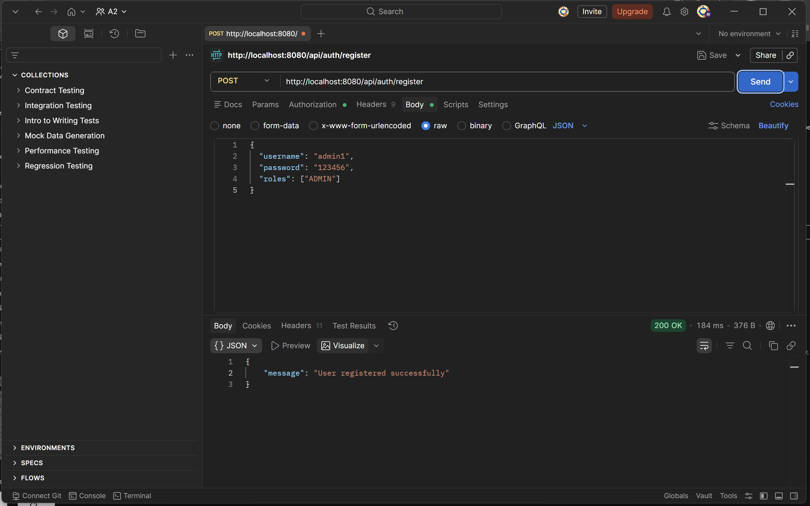
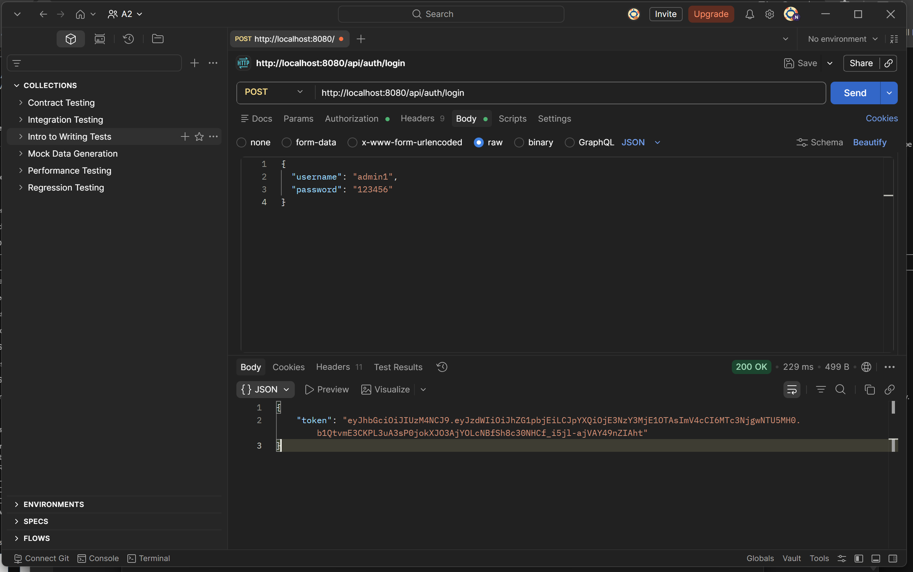
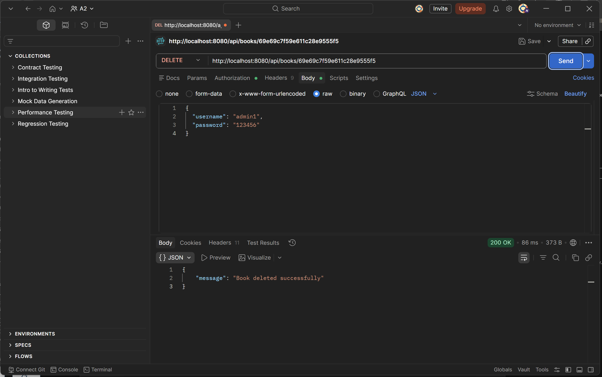
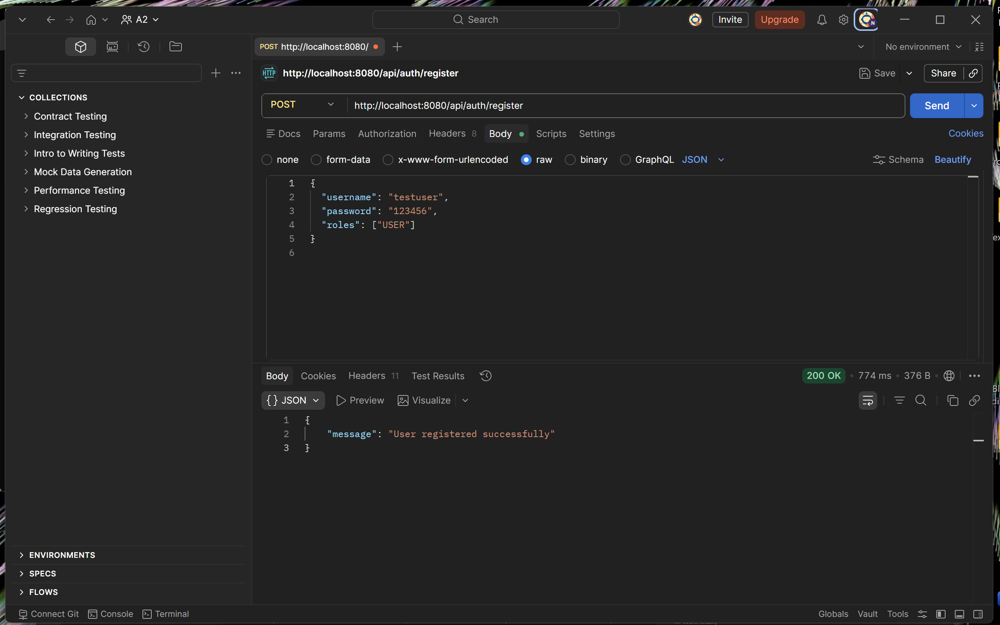
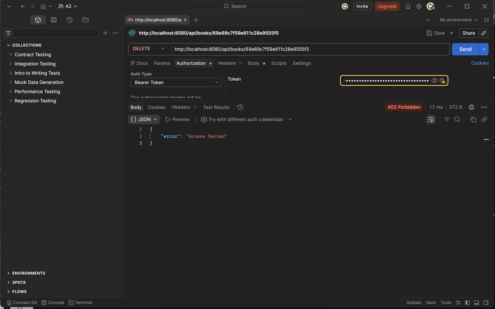

# Bookstore MongoDB

## Overview

In class, this project secured the Bookstore API with JWT authentication and added a `USER` role to protect the `POST /api/books` endpoint. This assignment extends the same project to implement role-based authorization for the delete operation so that only users with the `ADMIN` role can delete books.

## Completed Requirements

1. Added `DELETE /api/books/{id}` in `BookController.java`.
It returns `200 OK` when a book is deleted and `404 Not Found` if the book does not exist.

2. Updated `SecurityConfig.java`.
Only users with the `ADMIN` role can delete books.

3. Registered an ADMIN user in Postman.
The admin user has both `USER` and `ADMIN` roles.

4. Tested ADMIN delete access.
The admin user can log in, use a JWT token, and successfully delete a book with `200 OK`.

5. Tested USER delete access.
A user with only the `USER` role cannot delete a book and gets `403 Forbidden`.

## Postman Screenshots

1. Register the ADMIN user (200 OK response)  
   

2. Login as ADMIN and token visible in response  
   

3. DELETE request as ADMIN - 200 OK with success message  
   

4. DELETE request as USER - 403 Forbidden response  
5. 
   
